# EcoEats Development Timeline & Velocity Analysis
**Analysis Date**: February 8, 2026  
**Project Start**: ~January 2026  
**Target Demo**: February 2, 2026 (MISSED)

---

## 📅 Historical Timeline

```
Week 1 (Jan 20-26)
├─ ✅ Next.js project initialization
├─ ✅ Tailwind CSS setup
├─ ✅ TypeScript configuration
└─ ✅ Basic project structure

Week 2 (Jan 27 - Feb 2)
├─ ✅ Landing page
├─ ✅ Public pages (how-it-works, learn, spotlight, donate, partners)
├─ ✅ Database schema design
├─ ✅ Auth pages (login, signup)
├─ ✅ Auth API routes (register, login, logout, session)
├─ ✅ Basic middleware
└─ 🎯 TARGET DEMO DATE: Feb 2 (missed)

Week 3 (Feb 3-8)
└─ 📊 Status assessment (this document)
```

### Velocity Metrics

**Total Days Elapsed**: ~15-20 days  
**Work Completed**: Foundation + UI (~12% of MVP)  
**Work Remaining**: Core business logic (~88% of MVP)  

**Average Velocity**: 
- Pages: ~10 pages in 2 weeks = **0.7 pages/day**
- API Routes: 4 auth routes in 2 weeks = **0.3 routes/day**
- Features: 0 complete user journeys = **0%**

---

## 🎯 Projected Timeline to MVP

### Based on Current Velocity (Conservative)

```
Remaining Work:
- 21 API routes needed @ 0.3 routes/day = 70 days
- 4 user journeys @ unknown velocity = ???
- QR system (new) = 3-5 days
- Testing & deployment = 5 days

Total: ~80+ days at current pace
Expected Completion: Late April 2026
```

### Based on Focused Sprint (Optimistic)

```
Scenario: 1 full-time developer, 8 hours/day, no distractions

Week 1 (Feb 9-15): Core Flow
├─ Days 1-2: Request & Approval APIs + UI
├─ Days 3-4: Voucher System + QR Codes
├─ Day 5: Partner Redemption
└─ Weekend: Testing & Fixes

Week 2 (Feb 16-22): Supporting Features
├─ Days 1-2: Surplus System
├─ Day 3: Donor Flow
├─ Day 4: Impact Analytics
└─ Day 5: Polish & Bug Fixes

Week 3 (Feb 23-Mar 1): Launch
├─ Days 1-2: End-to-end testing
├─ Day 3: Deployment
├─ Days 4-5: Demo prep & rehearsal
└─ Target Launch: Mar 1, 2026 (21 days from now)
```

### Based on Team Sprint (Realistic)

```
Scenario: 2 developers splitting work

Week 1 (Feb 9-15)
Developer A:
├─ Request & Approval system
├─ Admin dashboard
└─ Impact tracking

Developer B:
├─ Voucher system + QR codes
├─ Beneficiary dashboard  
└─ Partner redemption

Week 2 (Feb 16-22)
Developer A:
├─ Surplus system
├─ Testing & fixes

Developer B:
├─ Donor flow
├─ Deployment & demo prep

Target Launch: Feb 22, 2026 (14 days from now)
```

---

## 📊 Feature Complexity Analysis

### Quick Wins (1-2 hours each)
- ✅ Static pages (already done)
- ❌ Session management API
- ❌ Request listing APIs
- ❌ Basic CRUD operations

### Medium Complexity (4-6 hours each)
- ❌ Request approval workflow
- ❌ Voucher issuance system
- ❌ Impact event logging
- ❌ Partner profile management
- ❌ Surplus listing/claiming

### High Complexity (8+ hours each)
- ❌ QR code generation + scanning
- ❌ Payment gateway integration
- ❌ Analytics dashboard
- ❌ Email notification system
- ❌ End-to-end testing

### Very High Complexity (12+ hours)
- ⭐ Real-time notifications
- ⭐ Advanced fraud detection
- ⭐ Multi-language support
- ⭐ Mobile app

---

## 🔥 Critical Path Analysis

### Dependency Chain for MVP

```mermaid
graph TD
    A[User Auth ✅] --> B[Create Request ❌]
    B --> C[Admin Approval ❌]
    C --> D[Issue Voucher ❌]
    D --> E[Display QR Code ❌]
    E --> F[Scan/Redeem ❌]
    F --> G[Record Impact ❌]
    G --> H[Show Metrics ❌]
    
    style A fill:#90EE90
    style B fill:#FFB6C1
    style C fill:#FFB6C1
    style D fill:#FFB6C1
    style E fill:#FFB6C1
    style F fill:#FFB6C1
    style G fill:#FFB6C1
    style H fill:#FFB6C1
```



**Observation**: 7 out of 8 critical features are incomplete. System cannot function without all 8.

### Parallel Work Opportunities

```
Track 1 (Beneficiary Journey):
├─ Create request API
├─ Request form UI
├─ Voucher wallet UI
└─ QR code display

Track 2 (Admin Journey):
├─ List requests API  
├─ Approval API
├─ Voucher issuance API
└─ Admin dashboard UI

Track 3 (Partner Journey):
├─ Partner setup API
├─ Redemption API
├─ QR scanner UI
└─ Redemption history UI

Track 4 (Infrastructure):
├─ QR code library integration
├─ Impact event logging
├─ Analytics queries
└─ Demo data seeding
```

**Potential**: 4 developers could work in parallel, reducing timeline to 7-10 days.

---

## 🚧 Blockers & Risks

### Current Blockers

1. **No Working User Journey** (Critical)
   - Cannot demo anything end-to-end
   - Cannot validate requirements
   - Cannot get user feedback

2. **QR Code System Undefined** (High)
   - No library selected
   - No scanning approach decided
   - Affects 3 user roles

3. **Payment Gateway Not Integrated** (Medium)
   - Blocks donor flow
   - May need test account setup
   - Could be bypassed with manual process

4. **No Test Data** (Medium)
   - Cannot manually test flows
   - Slows development
   - Need seed script

### Risk Timeline

```
Today (Feb 8):
└─ Risk: No working prototype, demo date passed

Feb 15 (1 week):
├─ Best case: Core flow working
├─ Worst case: Still building APIs
└─ Risk: Team morale if no progress

Feb 22 (2 weeks):
├─ Best case: MVP ready for demo
├─ Worst case: Partial features, nothing complete
└─ Risk: Scope creep, feature incomplete

Mar 1 (3 weeks):
├─ Best case: Deployed, demo ready
├─ Worst case: Still testing
└─ Risk: Stakeholder confidence

Mar 15 (5 weeks):
└─ Deadline: If not launched by now, project at risk
```

---

## 💡 Velocity Improvement Strategies

### Quick Wins to Boost Velocity

1. **Create Seed Data Script** (2 hours)
   - Pre-populate test users for all roles
   - Sample requests, vouchers, partners
   - Eliminates manual testing setup
   - **Impact**: 30min saved per feature test

2. **Standardize API Pattern** (1 hour)
   - Create template for new API routes
   - Copy-paste boilerplate
   - **Impact**: 15min saved per API route

3. **Component Library** (3 hours)
   - Button, Input, Card, Modal components
   - Consistent styling
   - **Impact**: 20min saved per page

4. **Use AI Assistance** (0 hours)
   - GitHub Copilot for boilerplate
   - ChatGPT for debugging
   - **Impact**: 25% faster coding

### Process Improvements

1. **Daily Standups** (15 min/day)
   - What did you complete?
   - What's blocking you?
   - What's next?

2. **Feature Branches** 
   - Work in isolation
   - Easier code review
   - Parallel development

3. **Testing Checklist**
   - Test before committing
   - Catch bugs early
   - Reduce rework

4. **Focus Blocks**
   - 2-hour uninterrupted coding
   - No meetings, no Slack
   - Higher quality work

---

## 📈 Success Metrics

### Week 1 Goals (Feb 9-15)

**Minimum Success**:
- [ ] 1 complete user journey working (request → approve → issue → display)
- [ ] Database has sample data
- [ ] Can demo to internal team

**Target Success**:
- [ ] 2 complete user journeys (add redemption)
- [ ] QR code generation working
- [ ] Basic admin dashboard

**Stretch Success**:
- [ ] All 4 user journeys complete
- [ ] Impact metrics showing
- [ ] Ready for external demo

### Week 2 Goals (Feb 16-22)

**Minimum Success**:
- [ ] All critical APIs working
- [ ] All dashboards populated with data
- [ ] Deployed to staging environment

**Target Success**:
- [ ] Surplus system working
- [ ] Donor flow (manual) working
- [ ] End-to-end testing complete
- [ ] Deployed to production

**Stretch Success**:
- [ ] Payment integration working
- [ ] Email notifications
- [ ] Advanced analytics

---

## 🎯 Velocity Tracking Template

### Daily Progress Log

**Date**: ___________  
**Developer**: ___________  
**Hours Worked**: ___________

**Completed**:
- [ ] Task 1 (time: ___ hours)
- [ ] Task 2 (time: ___ hours)

**In Progress**:
- [ ] Task 3 (% complete: ___)

**Blocked**:
- Issue 1: [description]
- Issue 2: [description]

**Tomorrow's Plan**:
- [ ] Task A (estimated: ___ hours)
- [ ] Task B (estimated: ___ hours)

**Velocity**: ___ features/day | ___ APIs/day | ___ pages/day

---

## 🏁 Realistic Expectations

### What Can Be Done in 1 Week
✅ **Possible**:
- Core request → approve → issue → display flow
- Basic QR code generation
- Simple admin dashboard
- Manual testing complete

❌ **Not Possible**:
- Full payment integration
- Advanced analytics
- Email notifications
- Mobile app
- Automated testing suite

### What Can Be Done in 2 Weeks
✅ **Possible**:
- All 4 user journeys working
- QR code scanning
- Surplus system
- Donor flow (manual)
- Basic impact metrics
- Deployed to production

❌ **Not Possible**:
- Real-time features
- Advanced fraud detection
- Multi-language
- Performance optimization

### What Can Be Done in 4 Weeks
✅ **Possible**:
- Everything in 2-week scope
- Payment integration
- Email notifications
- Advanced analytics
- Comprehensive testing
- Performance tuning
- Documentation

---

## 📞 Checkpoint Questions

**Ask yourself daily:**

1. Can I demo a working feature today?
2. Am I building the right thing?
3. Is this the simplest solution?
4. Have I tested this manually?
5. Did I commit working code?

**Ask your team weekly:**

1. Are we on track for our 1-week goals?
2. What's blocking the most progress?
3. Should we cut scope to ship faster?
4. Do we need help from outside?
5. Is everyone clear on priorities?

---

## 🚀 Bottom Line

**Current Velocity**: Too slow to meet original timeline  
**Projected Completion**: 2-3 weeks with focused effort  
**Recommendation**: Sprint mode for 2 weeks, cut non-critical features  
**Success Probability**: 70% if team focuses, 30% if scope creeps  

**Key Insight**: Building foundation (UI/DB) took 2 weeks and was 12% of work. Business logic is remaining 88% and will take much longer. Focus ruthlessly on critical path.

---

*Track your daily velocity against these projections. Update estimates weekly based on actual progress.*
